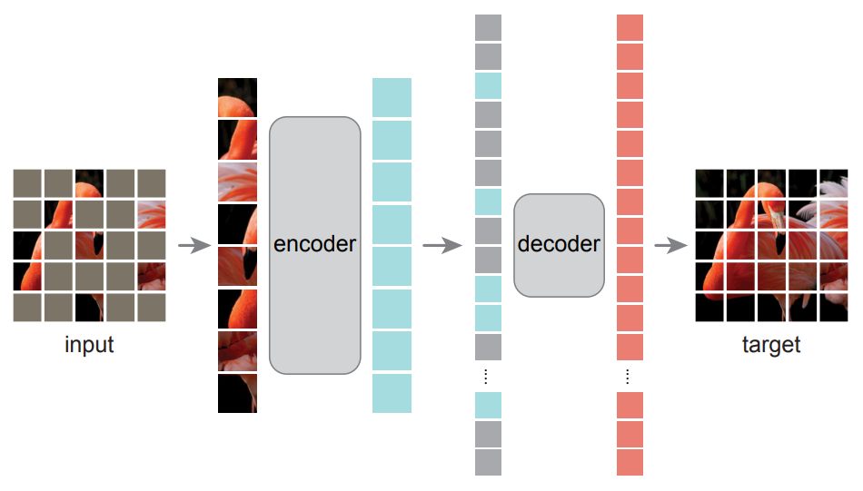
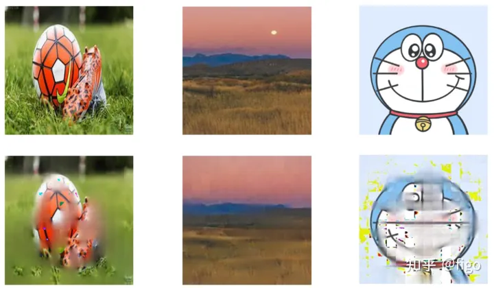

## **Unofficial Implementation of** Masked Autoencoders Are Scalable Vision Learners

<div align="center">
    
    <p> Fig. 1. Masked Autoencoders from Kaiming He et al. </p>
</div>

As soon as Masked Autoencoder (MAE🚀, Kaiming He et al.) was proposed, it received great attention from DL community, for its simple implementation but excellent performance on down stram tasks. Until recently, MAE and its follow-up works have advanced the state-of-the-art and provided valuable insights in research (particularly vision research). Here I make a full implementation of MAE based on vit-pytorch.

### Requirements
1. [🔥 **Python>=3.6.0**](https://www.python.org/)
2. [🔥 **torch >= 1.10**](https://pytorch.org/)
3. [🔥 **torchvision >= 0.13**](https://pytorch.org/vision/stable/index.html)
4. [🔥 **vit-pytorch**](https://github.com/lucidrains/vit-pytorch)
5. [🔥 **robustness**](https://github.com/MadryLab/robustness)

### MAE: Encoder

We use an [ViT](https://openreview.net/pdf?id=YicbFdNTTy) as the encoder of MAE. Here is the supported ViT models. Detailed parameter settings is available in [vit-configs](./config/vision_transformer.json).

```
vit_base_patch16_224
vit_base_patch16_384
vit_base_patch32_224
vit_base_patch32_384
vit_large_patch16_224
vit_large_patch16_384
vit_large_patch32_224
vit_large_patch32_384
```

### MAE: Train
We also provide a pipeline of training a MAE model. Detailed parameter settings is available in [mim-configs](./config/mim_config.json). If you want to train your MAE model, you just need to modify [mim-configs](./config/mim_config.json).
```
cd VIT
python mim_train_pipeline.py 
```

### MAE: Demo
Here are the testing results of a well trained MAE model (9 epochs training). You can add images into the [target folder](./image/target), which will be sent to MAE model, reconstruction results is available in [result folder](./image/result). Supported image formate concludes: 'bmp', 'jpg', 'jpeg', 'png', 'tif', 'tiff', 'dng', 'webp', 'mpo'. 

```
cd VIT
python mim_demo.py 
```

### MAE: Visual results
<div align="center">
    
    <p> Fig. 2. (Top) Input image. (Down) Output image after MAE reconstruction. </p>
    </figure>
<div>


Due to the limited gpu devices, it's really a chanllenge for us to pretrain with larger model or longer schedule mentioned in the paper. 

We'll release more pretrained encoder, which will reduce the difficulty of training MAE.

Last but not least, your star is my motivations, thank you!


### Reference
    
* [Masked Autoencoders Are Scalable Vision Learners](https://arxiv.org/abs/2111.06377) Kaiming He, Xinlei Chen, Saining Xie, Yanghao Li, Piotr Dollár, Ross Girshick
* https://github.com/lucidrains/vit-pytorch
* https://zhuanlan.zhihu.com/p/439554945
